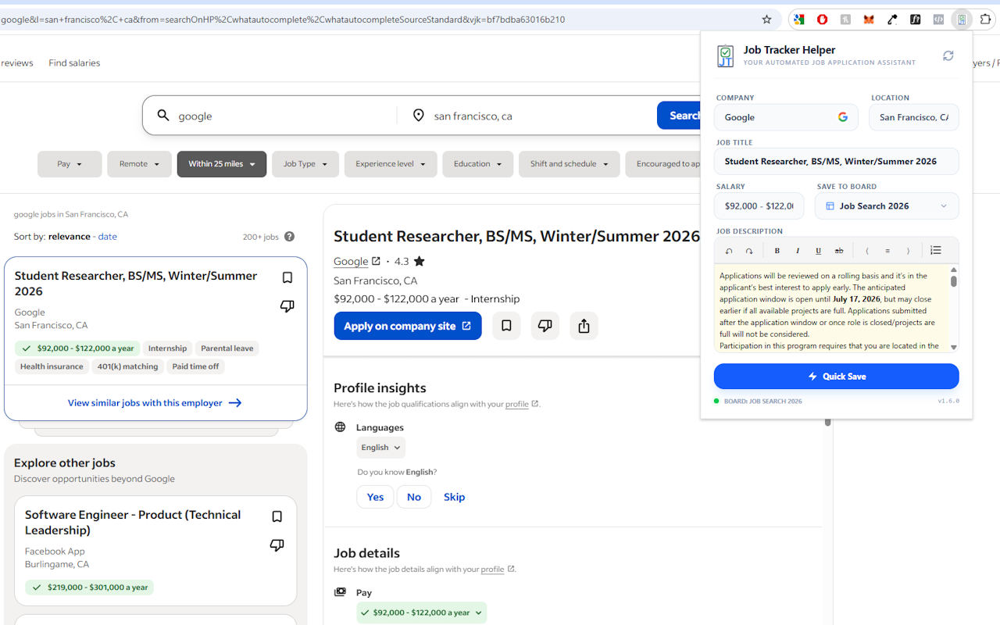
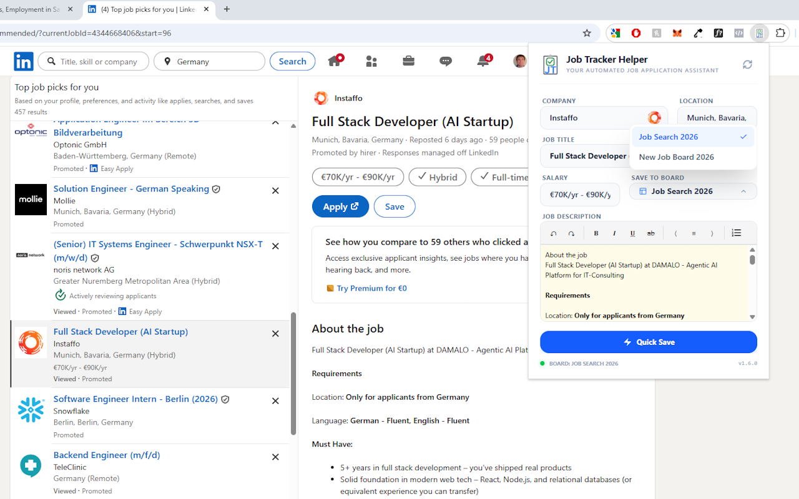
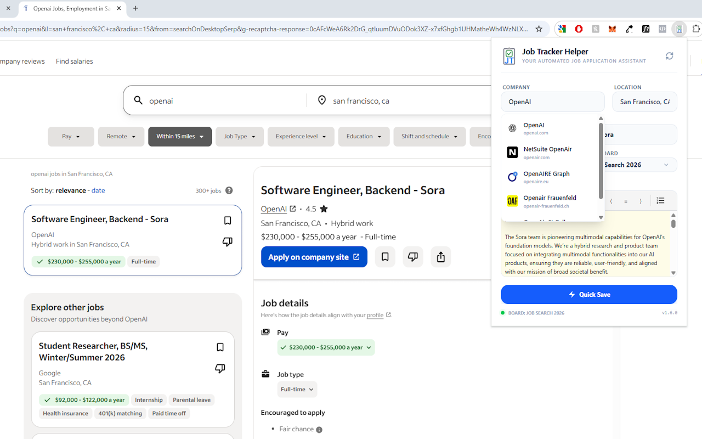
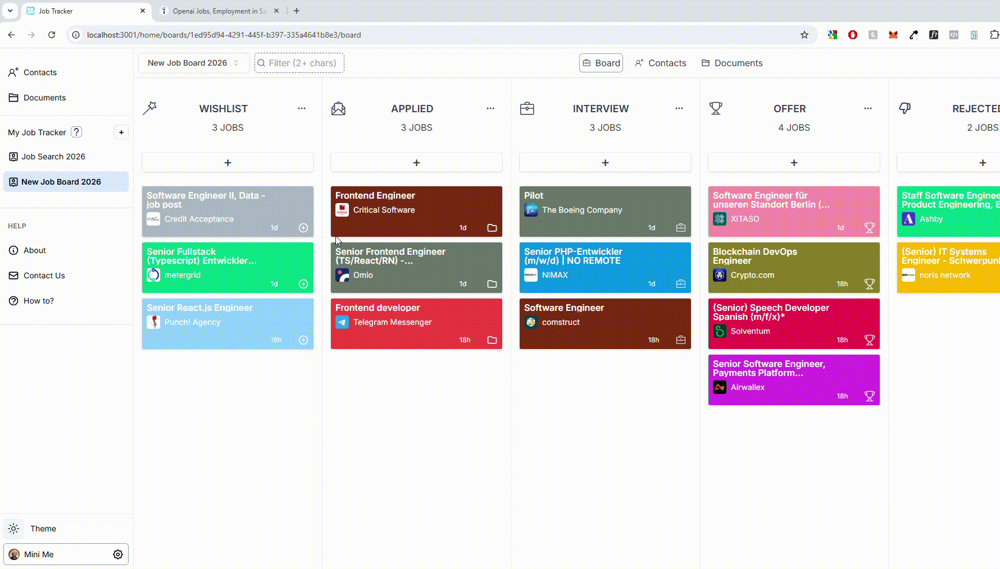

# Job Tracker Helper

[](https://github.com/Hombre2014/job-tracker-extension)
[](./LICENSE)
[](https://chrome.google.com/webstore/detail/glgdiphhpjibhpicdejajcpenjppoblg)

> Streamline your job search by automatically extracting job details from LinkedIn and Indeed with a single click.



## ⚠️ Important Disclaimer

**Terms of Service Compliance:**

This extension is designed for **personal use only** to help you organize your job search. When you use this extension to extract job posting data from LinkedIn, Indeed, or other job sites, you are responsible for complying with those platforms' Terms of Service.

Key Points:

- ✅ **User-Initiated Only**: The extension only works when YOU manually visit a job page and click to save
- ✅ **Personal Use**: Data is saved to YOUR personal Job Tracker account only
- ❌ **No Commercial Use**: Do not use this to build competing services or aggregate data for sale
- ❌ **No Automated Scraping**: This is not a bot or automated crawler

While we believe user-initiated extraction of publicly visible data for personal organization falls within fair use, LinkedIn and Indeed have Terms of Service that may restrict data extraction. By using this extension, you acknowledge your responsibility to comply with all applicable terms and policies.

For more details, see our [Privacy Policy](./PRIVACY_POLICY.md).

## 🎯 Overview

Job Tracker Helper is a browser extension that eliminates the tedious task of manually copying job information. Simply click the extension icon while viewing any LinkedIn or Indeed job posting, and all details are instantly saved to your Job Tracker application.

**Perfect for job seekers who want to:**

- Track applications without manual data entry
- Keep detailed records of every opportunity
- Focus on applying rather than copying and pasting

## ✨ Features

### Core Functionality

- **🎯 One-Click Extraction**: Instantly capture job details with a single click
- **📋 Complete Data Capture**: Extracts job title, company, location, salary, and full description
- **💼 Smart Tab Management**: Reuses existing Job Tracker tabs instead of opening duplicates
- **💰 Intelligent Salary Detection**: Filters promotional text and captures real compensation data
- **🏢 Company Logo Capture**: Automatically fetches company logos when available
- **🔄 Real-time Sync**: Changes reflect instantly in your Job Tracker dashboard

### Platform Support

- ✅ **LinkedIn**: Full support for all job posting formats
- ✅ **Indeed**: Complete extraction including salary ranges
- 🔄 **Other Sites**: May work with sites using standard job posting formats

### Technical Highlights

- **No Data Truncation**: Full job descriptions up to 10MB stored securely
- **Secure Communication**: Origin validation and encrypted data transfer
- **Modern Architecture**: Built with React, TypeScript, and TailwindCSS
- **Smart Fallbacks**: Multiple extraction strategies ensure reliability

## 📸 Screenshots

### Extension in Action


_The extension popup showing scraped job data ready to save_


_Extracting job details from LinkedIn_


_Extracting job details from Indeed_

## 🚀 Quick Start

### For Users

1. **Install from Chrome Web Store**
   - Visit the Chrome Web Store listing [Job Tracker Helper](https://chrome.google.com/webstore/detail/glgdiphhpjibhpicdejajcpenjppoblg)
   - Click "Add to Chrome"
   - Accept permissions

2. **Set Up Job Tracker App**
   - Create an account at [Job Tracker](https://online-job-trackr.vercel.app)
   - Create your first job board

3. **Start Tracking Jobs**
   - Navigate to any LinkedIn or Indeed job posting
   - Click the Job Tracker Helper icon in your browser toolbar
   - Select your target board
   - Click "Quick Save"
   - Done! Job is now in your tracker

### How It Works



1. **Browse** job postings on LinkedIn or Indeed
2. **Click** the extension icon
3. **Select** your target board (optional)
4. **Save** with one click
5. **View** in your Job Tracker dashboard

## Built With

- Libraries: React
- Framework: Vite
- Tooling: CRXJS Vite Plugin
- Styling: TailwindCSS
- Major languages: TypeScript

## 🛠️ Development Setup

### Prerequisites

- Node.js 18+ and npm
- Chrome or Edge browser
- Job Tracker frontend running locally or access to production

### Developer Installation

1. **Clone the repository**:

   ```bash
   git clone https://github.com/Hombre2014/job-tracker-extension
   cd job-tracker-extension
   ```

2. **Install dependencies**:

   ```bash
   npm install
   ```

3. **Start development server**:

   ```bash
   npm run dev
   ```

   _This generates a `dist` folder with the extension._

4. **Load in browser**:
   - Open Chrome/Edge and navigate to `chrome://extensions/`
   - Enable **Developer mode** (toggle in top right)
   - Click **Load unpacked**
   - Select the `dist` folder

5. **Configure Job Tracker URL** (if using local development)
   - Update allowed origins in `src/background/index.ts` if needed
   - Default: `https://online-job-trackr.vercel.app` (production)
   - Dev mode auto-detects `localhost:3000` and `localhost:5173`

### Build for Production

```bash
npm run build
```

The production-ready extension will be in the `dist` folder.

## 📚 Project Structure

```text
job-tracker-extension/
├── src/
│   ├── background/         # Service worker for message handling
│   ├── content/           # Content scripts for page scraping
│   │   ├── index.ts       # Message forwarding and coordination
│   │   └── scrapers.ts    # LinkedIn & Indeed scraping logic
│   ├── assets/            # Icons and static assets
│   ├── App.tsx            # Main popup component
│   └── main.tsx           # React entry point
├── public/                # Static files
├── docs/                  # Documentation and screenshots
│   ├── CHANGELOG.md       # Version history
│   └── screenshots/       # Store listing images
├── manifest.json          # Extension manifest
└── vite.config.ts         # Vite + CRXJS configuration
```

## 🔒 Security & Privacy

- **No External Servers**: Data goes directly from your browser to Job Tracker
- **No Tracking**: We don't collect usage data or analytics
- **Secure Origins**: Strict origin validation prevents unauthorized access
- **Local Storage Only**: Job data and drafts are stored locally in your browser. We do not collect, track, or transmit user data to external servers except when you explicitly save jobs to your Job Tracker account.
- **Open Source**: Code is transparent and auditable

## 🎉 What's New in v1.6.2

### Security Enhancements

- Fixed origin validation vulnerability to prevent subdomain attacks
- Enhanced message acknowledgment with origin verification

### Major Improvements

- **Smart Tab Management**: Extension now reuses existing Job Tracker tabs instead of opening duplicates
- **Accurate Board Selection**: Jobs save to your selected board, not the currently open one
- **Enhanced Salary Detection**: Better capture of salary information including currency codes (EUR, USD, GBP, CHF)

### Bug Fixes

- Removed "- job post" suffix from Indeed job titles
- Fixed dev mode detection to properly identify local development
- Improved zero-value salary filtering
- Fixed autoSave consistency across tab operations

See [CHANGELOG.md](./docs/CHANGELOG.md) for complete version history.

## Related Repositories

- [Job Tracker Frontend](https://github.com/Hombre2014/job-tracker-frontend)
- [Job Tracker Backend](https://github.com/Hombre2014/job-tracker-backend)

## Author

👤 **Yuriy Chamkoriyski**

- GitHub: [@Hombre2014](https://github.com/Hombre2014)
- Twitter: [@Chamkoriyski](https://twitter.com/Chamkoriyski)
- LinkedIn: [axebit](https://linkedin.com/in/axebit)

## 🤝 Contributing

This is a private project. For feature requests or bug reports, please contact the maintainer.

## Show your support

Give a ⭐️ if you like this project!

## 📝 License

This project is [Proprietary](./LICENSE) licensed. No modifications or distributions of modified versions are allowed without prior written permission.

---

**Note**: This extension requires an active Job Tracker account to function. Currently optimized for LinkedIn and Indeed, with potential support for other job sites.

Built with ❤️ to make job hunting less tedious.
